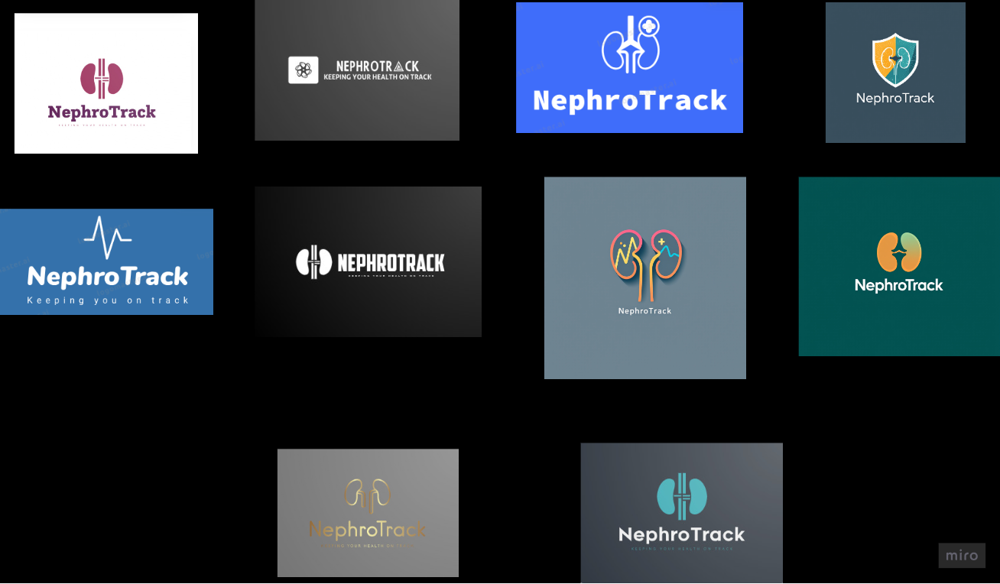
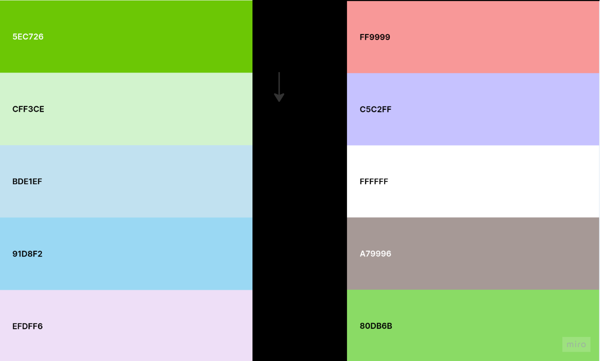

  
  
  

# NHS CKD Risk Calculator (Agile XP Project)

**Team 33 – "NephroTrack" | Kingston University**  
Client-style project to design a **Chronic Kidney Disease (CKD) risk calculator** for NHS use.  
I served as **Project Manager**, focusing on planning, UML and documentation, testing coordination, and stakeholder delivery.

> Transparency: This is a group project. My coding input was limited; this repository showcases process, artefacts, and delivery rather than full implementation.

---

## Project Overview

- Designed a lightweight **CKD risk calculator** to support early detection and clinical decision-making.  
- Followed the **Agile XP lifecycle**, from user stories to iteration planning, testing, and presentation.  
- Delivered a full set of professional artefacts including UML diagrams, testing plans, and a user manual.

---

## Repository Structure

| Folder | Description |
|--------|--------------|
| `docs/` | Core artefacts – user manual, security audit, iteration reports, and XP story/task cards |
| `diagrams/` | UML & Design Models (Use Case, Activity, Sequence, User Journeys) |
| `media/` | Visual assets – logos, colour schemes, and design ideas |
| `testing/` | Test plans and acceptance results |
| `slides/` | Client-facing presentation deck |

---

## My Role (Project Manager)

- Led **XP planning** – story cards, iteration management, daily stand-ups.  
- Produced and maintained **UML diagrams** and documentation.  
- Oversaw **testing strategy** and acceptance criteria.  
- Managed client expectations and presentation delivery.  
- Drafted the **security and privacy framework** aligned with GDPR Article 32.

---

## UML & Design Models

A consolidated document containing all UML and design artefacts used in development:

- Use Case, Activity, and Sequence diagrams  
- Persona journeys (Clinician, Patient, Under-18)  
- UI wireframes and layout concepts  
- Design rationale and accessibility considerations  

[View UML & Design Models (PDF)](diagrams/Team33_UML_and_DesignModels.pdf)

---

## System Overview

- **Inputs:** Demographics and clinical values (age, sex, creatinine, etc.)  
- **Logic:** Rule-based classification (Low / Moderate / High CKD risk)  
- **Outputs:** Risk band, suggested next steps, and printable summary  

No patient data is included; all examples use synthetic or dummy values.

---

## Testing Approach

- Acceptance and black-box testing aligned with user stories.  
- Validation of input handling and risk categorisation logic.  
- Usability and readability checks for clinician interface.

[View Test Report (PDF)](testing/Team33_Testing.pdf)

---

## Security and Privacy

Structured audit identifying and mitigating common risks in healthcare data systems:

- Role-based access control (RBAC)  
- Encryption of stored and transmitted data (AES-256, TLS)  
- Password protection and brute-force mitigation  
- Compliance with NHS Digital and GDPR Article 32

[View Security Audit (PDF)](docs/Team33_Security_Audit.pdf)

---

## Visual Identity

| Design Element | Preview |
|----------------|----------|
| **Possible Logos** |  |
| **Colour Schemes** |  |

---

## Tools and Technologies

| Category | Tools |
|-----------|-------|
| Project Management | Jira, Google Workspace |
| Design & UML | Lucidchart, Draw.io |
| Documentation | Microsoft Word, PowerPoint |
| Testing | Manual testing (black-box and acceptance) |

---

## Presentation

Final presentation summarising goals, development process, and client recommendations:

[View Presentation Slides](slides/Team33_Presentation.pptx)

---

## Credits

**Team 33 – NephroTrack (XP)**  
My Role: Project Manager  
Kingston University – BSc Cyber Security & Computer Forensics

---

## Related Projects

- [Splunk SOC Log Analysis (Portfolio)](https://github.com/Joe-Coffe)
